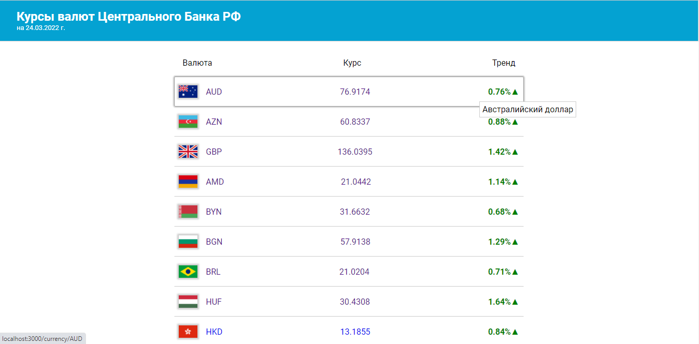
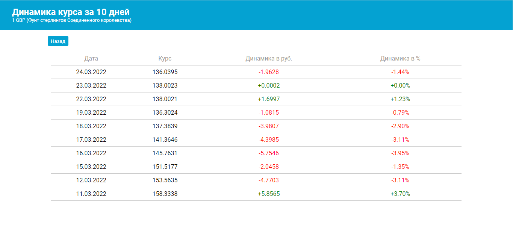

# Приложение для показа курсов валют по отношению к рублю 

## Техническое задание
Используя API `https://www.cbr-xml-daily.ru/` вывести на страницу список курсов валют на текущий день. В третьей колонке вывести процентное изменение курса относительно предыдущего дня. Данные за предыдущий период можно брать по ссылке формата `https://www.cbr-xml-daily.ru/archive/2022/02/11/daily_json.js`. 
Формат вывода - Код валюты, значение в рублях, разница в процентах в сравнении с предыдущим днем. Вывод в виде списка. При наведении на элемент списка он должен выделяться и под курсором должно отображаться полное название валюты в tooltip.
При клике на элемент списка отображается список по данной валюте за 10 дней.

Реализовать на ванильном JS либо React

[Live demo](https://)
# Использованные технологии

- ReactJS
- Styled-components

### Установка и запуск
- Клонировать репозиторий
- Перейти в корневой каталог
- Запустить команду `npm install` для установки зависимостей
- Запустить команду `npm start` для запуска приложения

## Автор

👤 **Tolib**

- GitHub: [@toliboff](https://github.com/toliboff)
- Twitter: [@tolib_tolibov](https://twitter.com/tolib_tolibov)
- LinkedIn: [Tolibjon Tolibov](https://linkedin.com/in/tolibjon-tolibov)
